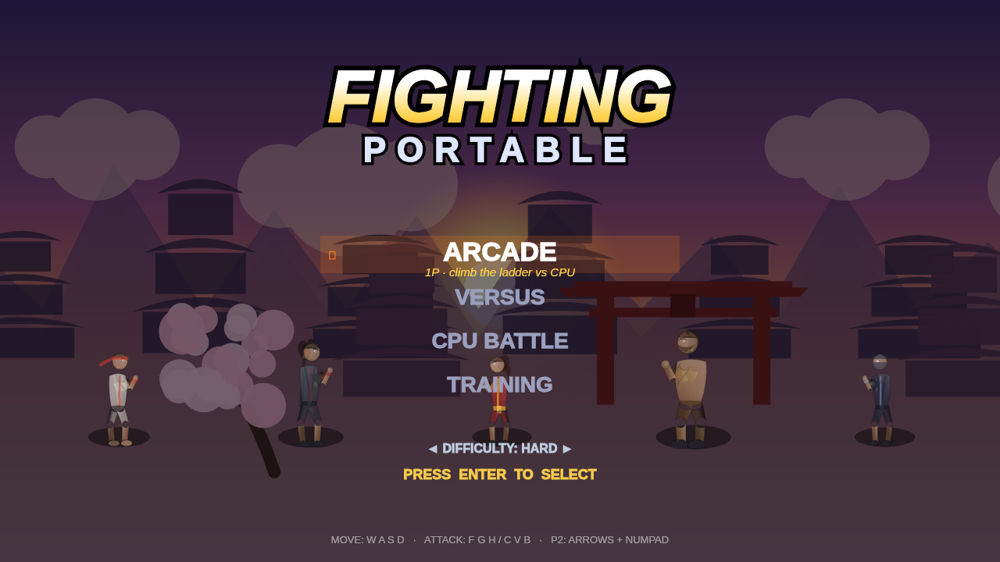
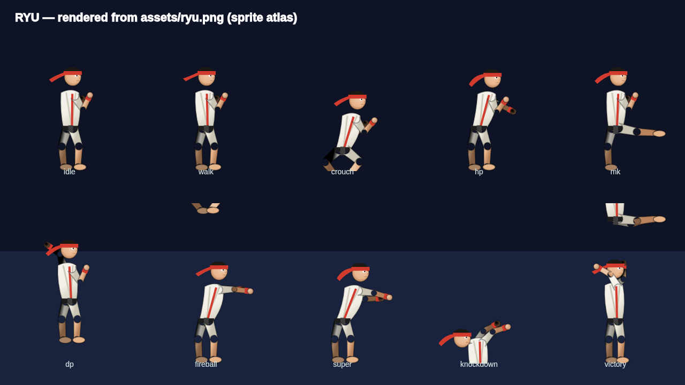
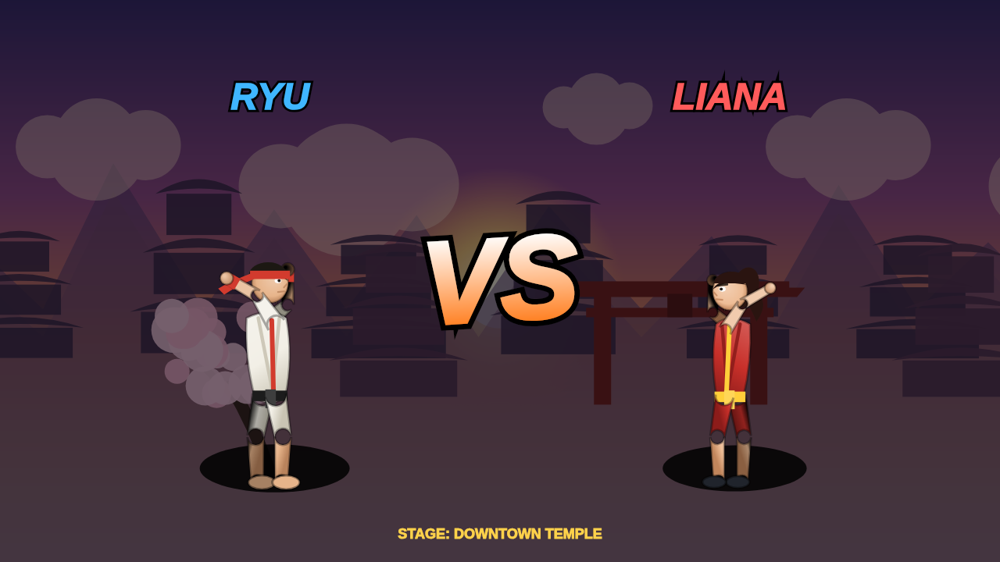
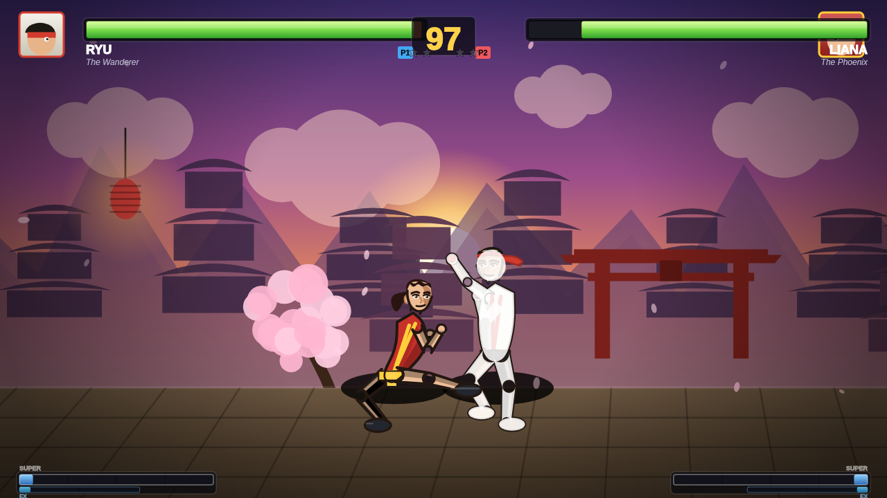
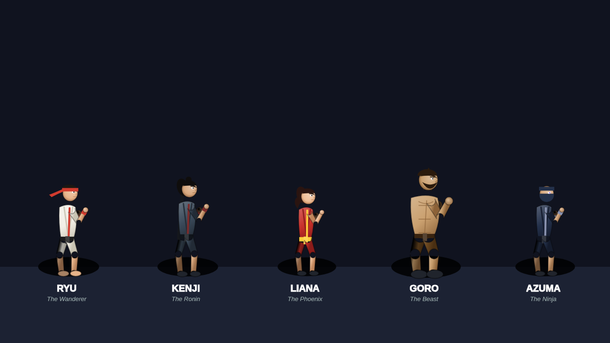
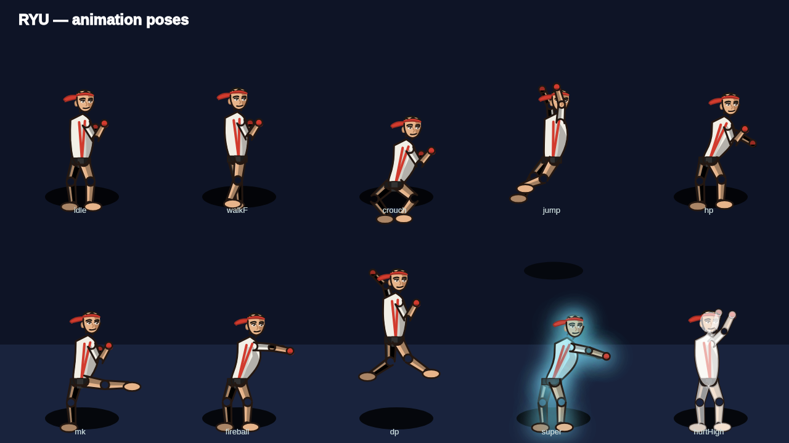

# 🥊 FIGHTING PORTABLE

A complete, browser-based **2D fighting game** built from scratch with the HTML5 Canvas — an original competitor in the classic arcade-fighter mold. Every fighter is **procedurally animated** with a skeletal rig, every sound is **synthesized**, and every backdrop is **drawn in code**: the game ships with **zero binary assets** and runs by simply opening `index.html`.



---

## ▶️ Play

**Option A — just open it**

```
Open index.html in any modern browser.
```

**Option B — local server (recommended, no caching surprises)**

```bash
npm run serve      # serves on http://localhost:8080
# or:  node server.js
```

No build step. No dependencies required to play. (`@napi-rs/canvas` is only a *dev* dependency used to render preview screenshots headlessly.)

---

## 🎮 Controls

| Action | Player 1 | Player 2 |
|---|---|---|
| Move / Jump / Crouch | `W A S D` | Arrow keys |
| Light / Medium / Heavy **Punch** | `F` `G` `H` | Numpad `4` `5` `6` |
| Light / Medium / Heavy **Kick** | `C` `V` `B` | Numpad `1` `2` `3` |
| Confirm / Pause | `Enter` / `Esc` | `Numpad Enter` |
| Mute | `M` | |

**Block** by holding *away* from your opponent. Hold *down-back* to block lows, stand-block to stop overheads.

**Throw** with Light Punch + Light Kick at close range.

### Special moves (motion inputs, just like the classics)

Notation is relative to the way you're facing (▶ = toward the opponent):

| Input | Move |
|---|---|
| ▼ ↘ ▶ + Punch | **Projectile** (Spirit Bolt / Flame Dart / Shuriken …) |
| ▶ ▼ ↘ + Punch | **Rising uppercut** (Dragon Fist / Phoenix Rise …) — invincible reversal |
| ▼ ↙ ◀ + Kick | **Advancing special** (Blade Kick / Cyclone Roll …) |
| ▼ ↘ ▶ ▼ ↘ ▶ + Punch | **SUPER** (needs a full meter) |

Do a special with **two** of its attack buttons (and at least half an EX bar) for an **EX** enhanced version. Goro the grappler swaps the projectile/uppercut for a **shockwave stomp** and **command grabs**.

Other keys: `M` mute · `Esc` / `P` pause · `O` sprite-atlas calibration overlay.

---

## 🖼️ Sprite assets (Ryu)

Ryu can be rendered from a **sprite sheet** (`assets/ryu.png`) through a full
atlas pipeline — frame slicing, a state→animation table, after-image trails and
a hurt-flash. If the sheet is missing the engine falls back to the procedural
renderer, so the game always runs. Every other fighter uses procedural art.

A placeholder `assets/ryu.png` is baked from the engine so the path is live out
of the box. **To use your own Ryu artwork, drop it in as `assets/ryu.png`** and
align it with the in-game calibration overlay (**press `O`**). Full instructions
in [`assets/README.md`](assets/README.md).



## ✨ Features

- **5 original fighters**, each a distinct archetype with its own proportions, palette, costume, stats and full movelist:
  - **Ryu — The Wanderer** (balanced shoto), **Kenji — The Ronin** (long-range swordsman),
    **Liana — The Phoenix** (fast rushdown), **Goro — The Beast** (slow grappler), **Azuma — The Ninja** (mix-up tricks).
- **Procedural skeletal animation** — one forward-kinematics humanoid rig drives idle, walk, dash, crouch, jump, block, every normal/crouching/jumping attack, three specials, a super, throws, hurt reactions, knockdown, get-up, intro and victory — with smooth breathing and momentum.
- **Real fighting-game systems:** hitboxes/hurtboxes, startup/active/recovery frame data, hitstun & blockstun, chip damage, **counter-hits**, **reversals**, **throws & throw-techs**, **combos with damage scaling**, juggles, knockdowns, wake-up, **super meter + EX gauge** (EX specials), motion-input buffering and corner pushboxes.
- **HUD assets:** animated health bars with chip-ghost, segmented **SUPER** + **EX** bars, round-timer, **win-stars** with P1/P2 badges, combo counter, and **COUNTER! / REVERSAL! / TECHNICAL! / K.O.** callouts.
- **Game feel:** fixed 60 Hz physics, **hit-stop** impact freeze, screen shake, hit sparks, dust, energy auras, fireball trails, a dynamic **camera** that follows and zooms, and **slow-mo KO** cinematics.
- **Two parallax stages** drawn entirely in code — *Downtown Temple* (sunset, torii gate, cherry blossoms, lanterns) and *Harbor Night* (moonlit skyline, cranes, embers).
- **Full game flow:** animated title, character select with live previews, VS splash, best-of-3 rounds, round timer, KO/Perfect/Time-Up, win pips, an **Arcade ladder**, local **Versus**, an **AI-vs-AI** attract mode and a **Training** dummy.
- **Synthesized audio** — all SFX, an arcade announcer and a layered music bed generated live with the WebAudio API.
- **Mobile touch controls** appear automatically on touch devices.




---

## 🧱 Architecture

Plain `<script>` modules sharing a single global namespace (`FP`) — no bundler, so it runs from `file://` or any static host.

```
index.html            shell + script load order
styles.css            framing, loader, touch overlay
js/
  utils.js            math, easing, color, RNG, AABB overlap
  input.js            keyboard + touch, command buffer, MOTION recognition (QCF/DP/QCB)
  audio.js            WebAudio SFX, announcer & music synthesis
  particles.js        pooled particle system
  effects.js          hit sparks, dust, auras, screen shake / flash / hit-stop
  camera.js           follow + dynamic zoom
  skeleton.js         FK humanoid rig + the procedural pose library
  characters.js       roster: proportions, palettes, stats, movelists
  render.js           draws a fighter from a solved skeleton (costumes, shading, hurt flash)
  stage.js            procedural parallax stages + props
  projectile.js       fireballs, shuriken, slashes, shockwaves, super beams
  fighter.js          the Fighter: state machine, physics, combat, specials, throws
  ai.js               CPU controller (drives the same virtual pad a human uses)
  hud.js              health bars (chip ghost), super meter, timer, pips, announcer
  match.js            the "world": rounds, combat resolution, KO sequence, draw order
  game.js             screens: title / select / vs / fight / result, arcade ladder
  main.js             loader, fixed-timestep loop, pause / mute, audio unlock
```

### Why procedural graphics?
Rather than chopping low-resolution sprites out of a promo sheet, every fighter is rendered each frame from an articulated skeleton. The result is clean, scalable, infinitely animatable, and gives each character consistent lighting, shadows and motion — closer to how a real engine drives a rig.

---

## 🧪 Tests

A headless harness (fake DOM + canvas) runs the **real engine** for thousands of frames across every matchup to catch runtime regressions in physics, AI, specials and the round/KO flow:

```bash
npm test            # node test/headless.js
```

Render real PNG frames for visual inspection (needs the dev dependency):

```bash
npm install         # installs @napi-rs/canvas
npm run preview     # writes frames to ./preview
```




---

## 📜 License

MIT. All characters, art, animation, audio and code are original works created for this project.
